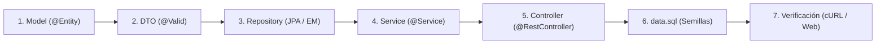

# Guía Paso a Paso y Hoja de Ruta para el Examen T1 (UPN - SIST1402A)

> **⚠️ REGLA DE ORO DE ENTREGA:**  
> Esta carpeta `documentos adicionales/` contiene tus apuntes y guías de desarrollo.  
> **Antes de comprimir tu proyecto en un archivo `.zip` para subirlo al Blackboard o enviárselo al profesor Carlos Ponte, SIMPLEMENTE ELIMINA ESTA CARPETA COMPLETA (`documentos adicionales/`)**.  
> De este modo, tu entrega quedará 100% limpia como un proyecto estándar de Spring Boot sin rastros de guías externas.

---

## 🧭 1. Identificación del Caso en el Examen

Cuando el profesor dicte o proyecte el enunciado del examen T1, identifica a cuál de estos 3 escenarios corresponde:

### 🟢 Escenario A: Pide el Caso de Pacientes / Posta Médica / Anemia
* **¡YA ESTÁ 100% IMPLEMENTADO Y PROBADO!**
* Revisa en [`Paciente.java`](../src/main/java/pe/upn/sist1402a/model/Paciente.java) si los nombres de atributos coinciden con lo que pide el examen (`dni`, `nombre`, `apellido`, `edad`, `nivelHemoglobina`).
* Si el profesor pide cambiar el umbral de anemia (por ejemplo, a `< 10.5` en vez de `< 11.0`), solo edita la línea en `getEstadoAnemia()` de `Paciente.java`.
* Si el profesor pide eliminar los otros casos para entregar solo Pacientes, simplemente borra `Producto.java`, `ItemGenerico.java` y sus respectivos controladores/servicios (ver sección de limpieza al final).

### 🟢 Escenario B: Pide el Caso de Productos / Almacén / Inventario
* **¡YA ESTÁ 100% IMPLEMENTADO Y PROBADO!**
* Revisa en [`Producto.java`](../src/main/java/pe/upn/sist1402a/model/Producto.java) los atributos (`codigo`, `nombre`, `precio`, `stock`, `categoria`).
* Si el profesor pide cambiar el umbral de stock insuficiente (por ejemplo, a `< 10`), solo edita `getEstadoStock()` en `Producto.java`.

### 🟡 Escenario C: Pide un Caso Nuevo Imprevisto (Ej. Vehículos, Citas, Cursos, Empleados)
* **ADAPTACIÓN EN 5 MINUTOS CON F2 (RENAME SYMBOL EN VS CODE):**
  1. Abre [`ItemGenerico.java`](../src/main/java/pe/upn/sist1402a/model/ItemGenerico.java).
  2. Haz clic sobre el nombre `ItemGenerico`, presiona **`F2`** y renómbralo al nombre del caso del examen (ej. `Vehiculo`). VS Code renombrará automáticamente la clase, el archivo y todas sus referencias.
  3. Renombra los atributos con `F2`:
     - `codigoIdentificador` -> `placa` o `codigo`
     - `denominacion` -> `modelo` o `nombre`
     - `valorNumericoPrincipal` -> `kilometraje` o `precio`
     - `cantidadEntera` -> `anioFabricacion` o `capacidad`
     - `clasificacionCalculada` -> regla `@Transient` que pida el profesor.
  4. Haz lo mismo con [`ItemGenericoDto.java`](../src/main/java/pe/upn/sist1402a/dto/ItemGenericoDto.java).

---

## ⚡ 2. El Flujo de Construcción en Cascada (De la BD al Controlador)

Si prefieres crear una entidad desde cero o te piden agregar una nueva tabla durante la sustentación, sigue estrictamente este orden cronológico:



---

### Paso 1: Capa de Modelo / Entidad JPA (`model/`) (Tiempo estimado: 2 min)
Crea la clase anotada con `@Entity` y `@Table(name = "tabla_en_plural")`:

```java
package pe.upn.sist1402a.model;

import jakarta.persistence.*;

@Entity
@Table(name = "pacientes")
public class Paciente {

    @Id
    @GeneratedValue(strategy = GenerationType.IDENTITY)
    private Long id;

    @Column(nullable = false, length = 8, unique = true)
    private String dni;

    @Column(nullable = false, length = 60)
    private String nombre;

    @Column(nullable = false)
    private Double nivelHemoglobina;

    // REGLA CLAVE: Campo calculado dinámico en memoria (NO se guarda en la BD)
    @Transient
    private String estadoAnemia;

    // REGLA DE ORO DE JACKSON: Constructor vacío obligatorio
    public Paciente() {}

    // Getters y Setters...
    public String getEstadoAnemia() {
        if (this.nivelHemoglobina == null) return "SIN_DATOS";
        return this.nivelHemoglobina < 11.0 ? "ANEMIA" : "NORMAL";
    }
}
```

---

### Paso 2: Objeto DTO con Bean Validation (`dto/`) (Tiempo estimado: 1.5 min)
Crea la clase DTO que recibirá los datos del formulario JSON con las restricciones:

```java
package pe.upn.sist1402a.dto;

import jakarta.validation.constraints.*;

public class PacienteDto {

    @NotBlank(message = "El DNI es obligatorio")
    @Size(min = 8, max = 8, message = "El DNI debe tener 8 dígitos")
    private String dni;

    @NotBlank(message = "El nombre es obligatorio")
    private String nombre;

    @NotNull(message = "La hemoglobina es obligatoria")
    @DecimalMin(value = "1.0", message = "La hemoglobina debe ser mayor a 1.0")
    private Double nivelHemoglobina;

    public PacienteDto() {}
    // Getters y Setters...
}
```

---

### Paso 3: Capa de Repositorio (`repository/`) (Tiempo estimado: 1.5 min)

#### A) Opción Spring Data JPA (Semana 04 a 06):
```java
package pe.upn.sist1402a.repository.springdata;

import org.springframework.data.jpa.repository.JpaRepository;
import org.springframework.data.jpa.repository.Query;
import org.springframework.data.repository.query.Param;
import org.springframework.stereotype.Repository;
import pe.upn.sist1402a.model.Paciente;
import java.util.List;

@Repository
public interface PacienteRepository extends JpaRepository<Paciente, Long> {
    
    // Consulta Derivada automática
    List<Paciente> findByNombreContainingIgnoreCase(String nombre);

    // Consulta JPQL Parametrizada SEGURA (Regla de oro: usar :param y @Param)
    @Query("SELECT p FROM Paciente p WHERE p.nivelHemoglobina < :limite")
    List<Paciente> buscarConHemoglobinaMenorA(@Param("limite") Double limite);
}
```

#### B) Opción EntityManager Manual (Semana 03):
```java
@Repository
@Transactional
public class PacienteEntityManagerRepository {
    @PersistenceContext
    private EntityManager em;

    public Paciente guardar(Paciente p) {
        if (p.getId() == null) { em.persist(p); return p; }
        else { return em.merge(p); }
    }

    public List<Paciente> listarTodos() {
        return em.createQuery("SELECT p FROM Paciente p", Paciente.class).getResultList();
    }
}
```

---

### Paso 4: Capa de Servicio (`service/` e `impl/`) (Tiempo estimado: 2 min)

```java
@Service
@Transactional
public class PacienteServiceImpl implements IPacienteService {

    private final PacienteRepository repo;

    public PacienteServiceImpl(PacienteRepository repo) {
        this.repo = repo;
    }

    @Override
    @Transactional(readOnly = true)
    public List<Paciente> listarTodos() {
        return repo.findAll();
    }

    @Override
    @Transactional(readOnly = true)
    public Paciente buscarPorId(Long id) {
        return repo.findById(id)
            .orElseThrow(() -> new ResourceNotFoundException("Paciente", "id", id));
    }

    @Override
    public Paciente registrar(PacienteDto dto) {
        Paciente p = new Paciente();
        p.setDni(dto.getDni());
        p.setNombre(dto.getNombre());
        p.setNivelHemoglobina(dto.getNivelHemoglobina());
        return repo.save(p);
    }

    @Override
    public void eliminar(Long id) {
        Paciente p = buscarPorId(id);
        repo.delete(p);
    }
}
```

---

### Paso 5: Controlador REST Semántico (`controller/`) (Tiempo estimado: 2 min)

```java
@RestController
@RequestMapping("/api/pacientes")
@CrossOrigin(origins = "*")
public class PacienteController {

    private final IPacienteService service;

    public PacienteController(IPacienteService service) {
        this.service = service;
    }

    @GetMapping
    public ResponseEntity<List<Paciente>> listar() {
        return ResponseEntity.ok(service.listarTodos());
    }

    @GetMapping("/{id}")
    public ResponseEntity<Paciente> buscarPorId(@PathVariable Long id) {
        return ResponseEntity.ok(service.buscarPorId(id));
    }

    @PostMapping
    public ResponseEntity<Paciente> registrar(@Valid @RequestBody PacienteDto dto) {
        return new ResponseEntity<>(service.registrar(dto), HttpStatus.CREATED);
    }

    @DeleteMapping("/{id}")
    public ResponseEntity<Void> eliminar(@PathVariable Long id) {
        service.eliminar(id);
        return ResponseEntity.noContent().build();
    }
}
```

---

### Paso 6: Datos Semilla en `data.sql` (Tiempo estimado: 30 seg)
Edita `src/main/resources/data.sql` y agrega 2 o 3 inserts con datos reales para demostrar persistencia inmediata:

```sql
INSERT INTO pacientes (dni, nombre, apellido, edad, nivel_hemoglobina) VALUES ('70123456', 'Carlos', 'Mendoza', 5, 9.8);
INSERT INTO pacientes (dni, nombre, apellido, edad, nivel_hemoglobina) VALUES ('70987654', 'María', 'Rojas', 4, 12.5);
```

---

### Paso 7: Comprobación Rápida en Vivo (Tiempo estimado: 1 min)
Inicia el servidor en la terminal:
```powershell
.\mvnw.cmd spring-boot:run
```
Abre en tu navegador:
1. **Frontend HTML Nativo:** [http://localhost:8080/index.html](http://localhost:8080/index.html) -> Puedes crear, listar y eliminar visualmente.
2. **Swagger UI:** [http://localhost:8080/swagger-ui/index.html](http://localhost:8080/swagger-ui/index.html) -> Puedes probar los endpoints interactivamente.
3. **Consola H2:** [http://localhost:8080/h2-console](http://localhost:8080/h2-console) -> Conectar con JDBC `jdbc:h2:mem:enterprise_db` y usuario `sa`.

---

## 📋 3. Cheat Sheet de Anotaciones para Responder al Docente

Si el Ing. Carlos Ponte Ramírez te pregunta durante la sustentación qué significa cada anotación, responde con estas definiciones exactas:

| Anotación | ¿Qué hace y por qué se usa? |
| :--- | :--- |
| `@Transient` | Indica al ORM Hibernate que este atributo **NO debe crearse como columna en la tabla de la base de datos**. Se calcula dinámicamente en memoria y Jackson lo serializa en el JSON. |
| `@PersistenceContext` | Inyecta la instancia del `EntityManager` gestionada por el contenedor de Spring/JPA para operaciones de persistencia de bajo nivel (Semana 03). |
| `@Transactional` | Delimita una transacción atómica (ACID). Si ocurre una excepción no controlada (`rollbackFor = Exception.class`), se revierten todos los cambios en la base de datos. |
| `@Valid` | Activa el validador Bean Validation (JSR-380) en el `@RequestBody` antes de que entre al método. Si falla, Spring lanza `MethodArgumentNotValidException`. |
| `@RestControllerAdvice` | Interceptor global de excepciones para toda la API REST. Captura los errores y los transforma en respuestas JSON estructuradas con códigos HTTP adecuados (400, 404, 500). |
| `@CrossOrigin(origins = "*")` | Habilita las políticas CORS para permitir que clientes en otros puertos (como Angular en el puerto 4200) puedan consumir la API sin ser bloqueados por el navegador. |
| `@Query` y `@Param` | Permite escribir consultas JPQL orientadas a entidades. El uso de `:nombre` con `@Param` enlaza parámetros de forma segura y **evita ataques de inyección SQL**. |

---

## 🎯 4. Balotario de Respuestas Rápidas para la Sustentación Oral

1. **¿Por qué se usan DTOs en lugar de recibir directamente la entidad `@Entity` en el controlador?**  
   *Respuesta:* Por seguridad y desacoplamiento. Evita la vulnerabilidad de sobreasignación masiva (*Mass Assignment*), previene bucles infinitos en serialización Jackson y desacopla el contrato del cliente del esquema relacional de la BD.

2. **¿Por qué toda entidad JPA debe tener un constructor vacío por defecto?**  
   *Respuesta:* Porque tanto Hibernate (al reconstruir la entidad desde una consulta JDBC) como Jackson (al deserializar el JSON del request) utilizan reflexión de Java (`Class.getDeclaredConstructor().newInstance()`).

3. **¿Cuál es la diferencia entre `EntityManager` (S03) y `JpaRepository` (S04-S06)?**  
   *Respuesta:* `EntityManager` es la interfaz estándar nativa de JPA para control fino del ciclo de vida y operaciones manuales. `JpaRepository` es una abstracción de alto nivel de Spring Data que autogenera la implementación de las operaciones CRUD y consultas derivadas mediante interfaces.

4. **¿Por qué está prohibido concatenar strings en JPQL?**  
   *Respuesta:* Porque la concatenación (`WHERE p.nombre = '` + nombre + `'`) genera vulnerabilidad crítica a inyección SQL/JPQL. Se deben usar parámetros enlazados `:param` con `@Param`.

5. **¿Cómo se vincula el caso con el ODS 09 (Industria, Innovación e Infraestructura)?**  
   *Respuesta:* El software implementa infraestructura digital interoperable y automatizada, reemplazando registros manuales en papel por un sistema resiliente que reduce errores diagnósticos y optimiza la toma de decisiones clínicas y logísticas.

---

## 🧹 5. Checklist Final de Entrega (15 Segundos antes de Enviar)

- [ ] Detén el servidor en la consola (`Ctrl + C`).
- [ ] Ejecuta `.\mvnw.cmd clean` en la terminal (esto borra la carpeta `target/` y reduce el peso del proyecto de 40 MB a solo 200 KB).
- [ ] **Elimina la carpeta `documentos adicionales/`**.
- [ ] Comprime la carpeta raíz `enterprise-web-solutions-spring-boot` en un archivo `.zip`.
- [ ] Sube el archivo `.zip` al aula virtual. ¡Listo para tu 20 / 20!
